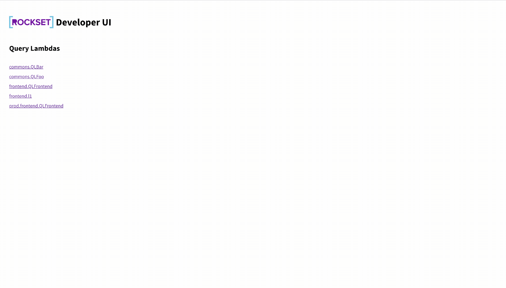

# Rockset Projects Developer UI

The Official Home of the Rockset Projects Developer UI.




## Getting Started

The Rockset Projects Dev UI is bundled with the Rockset CLI. Please first install and setup up the [Rockset CLI](../cli). It is intended to be used in a Rockset Project. Please see the CLI documentation for more information about setting up your Rockset Project.

```bash
# Initialize your rockset project
$ rockset local:init

# Download your query lambdas
$ rockset local:download

# Serve the IDE Sidecar
# Make sure you run this command in a valid Rockset Project.
$ rockset local:serve -p PORT
```

This will launch a development server on `localhost:PORT`. Whenever a request to execute a query lambda is sent to the server, it will grab the associated Query Lambda text from the file system and execute it with any parameters.

The Projects Dev UI is tested and fully supported on the latest version of Google Chrome. You may experience bugginess on other browsers.

## Usage

Once you have started the development server, navigate to `localhost:PORT` in your browser.

You should see a listing of all of the different Query Lambdas in your Rockset Project. Select one of the Query Lambdas to start executing it.

### Executing a Lambda

When you hit the Run button, the following happens:

1. The UI sends a request to the development server to run the associated query 
1. The development server loads the SQL text and Default Parameters for the Query Lambda from your local file system 
1. The development server sends a request to Rockset's remote API Server, using the active credentials configured for the CLI tool. 
1. The development server passes the response to the UI

This means that all queries will execute the version in the local file system. Furthermore, the queries will be executed in the account associated with the CLI tool's current active profile. 

### Using Parameters

Rockset SQL supports adding Query Parameters to parameterize a Query. To add parameters in the Rockset Development UI, click into the Parameters Tab and then click the "Add Parameters" button. You can also add default values for your Parameters in the Lambda Definition File. Please see the [Rockset CLI Documentation](../cli) for more information about adding default parameters.
