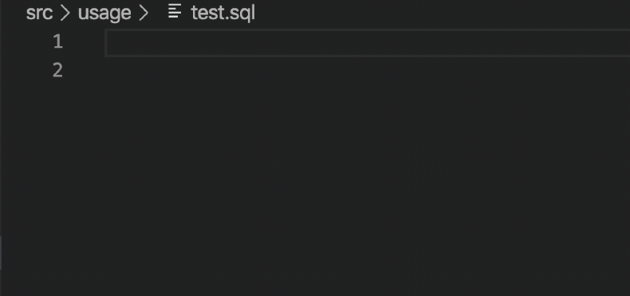

# Rockset VSCode README

## Features

* Syntax highlighting
* Execute Queries
* Error Highlighting
* Autocomplete
* Formatting



## Beta Installation

```sh

// Download to current directory
curl https://rockset-cli-artifacts.s3-us-west-2.amazonaws.com/vscode-artifacts/rockset-vscode-0.1.3.vsix > rockset.vsix

// Install from current directory
code --install-extension rockset.vsix
```

## Usage

After installation, please first set the following two properties in your VSCode preferences (CMD-,).

* `rockset.apiserver`: The Rockset API server to use with this extension
* `rockset.apikey`: the Rockset apikey to use with this extension

The easiest way to get started with SQL files is to use [Rock CLI v2](../cli).

```bash

// Authenticate
rock auth:add <apikey>

// Populate your Query Lambda SQL from Rockset
rock project:init
rock project:download

// Open the current directory in VSCode
code .
```

Then simply open one of the SQL files in your project and edit. `CTRL-SHIFT-R` (`CMD-SHIFT-R` on Mac) is the shortkey to execute the current SQL file. This will not include any parameters, and is a little bit limiting.

You can also execute queries with the Rock Development UI as follows:

```
// After following the setup instructions above
rock project:serve
```

This will open up a UI in which you can easily execute your Query Lambdas.

## Extension Settings

Include if your extension adds any VS Code settings through the `contributes.configuration` extension point.

For example:
This extension contributes the following settings:

* `rockset.apiserver`: The Rockset API server to use with this extension
* `rockset.apikey`: the Rockset apikey to use with this extension

## Release Notes

Users appreciate release notes as you update your extension.

### 0.1.3

Supports syntax highlighting, executing a query, and formatting


